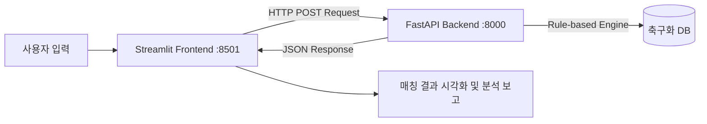

# 축구화 추천 프로그램 

본 프로젝트는 사용자의 플레이 스타일, 발볼 너비, 선호 무게감, 구장 환경, 예산 범위 등 5가지 핵심 요소를 종합 분석하여 가장 적합한 축구화 모델을 브랜드별로 추천하는 시스템입니다. 
Streamlit(프론트엔드)과 FastAPI(백엔드)가 REST API로 통신하며, **Docker Compose**를 통해 각 서비스가 독립된 컨테이너 환경에서 유기적으로 실행됩니다.

- **Front-end**: Streamlit ([front/app.py](front/app.py))
  - **접속 주소**: `http://<EC2의 퍼블릭 IP>:8501`
- **Back-end**: FastAPI ([back/main.py](back/main.py), [back/recommendation.py](back/recommendation.py))
  - **API 접속**: `http://<EC2의 퍼블릭 IP>:8000/`
- **Deployment**: Docker Compose ([docker-compose.yml](docker-compose.yml))

---

## 아키텍처 및 시스템 흐름

---

## 추천 데이터베이스 수록 제품군

본 프로젝트의 축구화 데이터는 각 브랜드의 한국 공식 홈페이지, KREAM, Crazy 11 등의 사이트를 참고하여 구성하였으며, 가격 정보는 공식 사이트의 정가를 기준으로 작성되었습니다.

| 브랜드 | 스피드 특화 | 컨트롤 특화 | 착화감 특화 |
| :--- | :--- | :--- | :--- |
| **Nike** | 줌 머큐리얼 베이퍼 17 | 팬텀 6 로우 | 티엠포 |
| **Adidas** | F50 | 프레데터 | 코파 퓨어 III·IV |
| **Puma** | 울트라 6 | 퓨처 9 | 킹 20 |

### 참고 사항

본 DB의 `fit` 및 `weight` 정보는 각 브랜드 내부의 대표 3대 사일로(Speed / Control / Comfort)를 상호 비교하여 분류한 상대적 기준입니다.

예를 들어 `heavy`는 축구화 전체 시장에서 무겁다는 의미가 아니라, 해당 브랜드 내 다른 사일로와 비교했을 때 상대적으로 무거운 모델을 의미합니다.

- Weight: light / normal / heavy
- Fit: narrow / normal / wide

## 최종 추천 결과 도출 프로세스

추천 엔진([recommendation.py](back/recommendation.py))은 사용자의 5가지 입력값을 기반으로 아래와 같은 3단계 프로세스를 거쳐 최종 결과를 도출합니다.

### 1) 브랜드별 최고 적합도 모델 선출 및 채점 (Scoring - 최대 100점)
각 브랜드(Nike, Adidas, Puma)별 3대 사일로를 아래의 가중치 점수 기준을 적용하여 채점하고, 가장 점수가 높은 최적의 모델 1개를 선정합니다.
* **플레이스타일 매칭** (최대 40점): 유저 선호 스타일과 사일로의 일치 여부
* **발볼 너비 매칭** (최대 40점): 유저 발볼과 축구화 핏 비교 (넓은 발볼 + 칼발 축구화 매칭 시 **-30점 페널티** 감점 적용)
  * **페널티 부여 목적**: 좁은 축구화에 넓은 발을 맞춰 신을 시 발생 가능한 부상을 예방하기 위해, 플레이 스타일(스피드 등)보다 신체 조건(발볼)을 최우선으로 보호하여 안전한 타 제품군으로의 대체 추천을 강제하기 위함입니다.
  * **30점 감점의 수치적 배경**: 다른 가중치 항목들(플레이스타일 40점, 무게 20점)과의 점수 편차 관계를 고려해 설계한 최적의 수치입니다. 감점폭이 너무 적으면(20점 이하) 가벼운 무게 등의 다른 선호 가중치에 묻혀 부적합한 좁은 신발이 여전히 추천되는 오류가 발생할 수 있고, 반대로 너무 크면(40점 이상) 최종 합산 점수가 최저 하한선인 0점으로 수렴해 모델 간의 세부 비교(무게감 차이, 미세 성향 등) 정밀도가 상실됩니다. 즉, 30점은 **확실한 대체 우회 추천 성능**과 **비교 분석의 정밀도**를 모두 만족시키는 최적의 균형점입니다.
* **선호 무게감 매칭** (최대 20점): 유저 선호 무게감과 축구화 무게감 일치 여부
* 유저 선호 스타일과 다른 사일로가 선정되었을 경우, 발볼 압박 및 부상 방지를 위해 해당 사일로로 대체 추천되었음을 알리는 안내문이 동적으로 추가됩니다.

### 2) 구장별 아웃솔 호환성 매칭 및 대체 추천 (Outsole Fallback)
* 선택한 구장 타입(FG, AG, TF)의 아웃솔이 해당 브랜드 등급에서 정식 출시되었는지 확인합니다.
* 만약 미출시된 사양인 경우, 백엔드의 `ground_fallback_order` 규칙에 맞춰 호환 가능한 다른 아웃솔(예: Puma FG/AG 대신 MG 등)을 자동으로 찾아 **"(대체 추천)"** 마커와 함께 반환합니다.

### 3) 사용자 예산 기반의 최적 등급 판별 (Economic Matching)
* 출시 가격 문자열에서 정규식(`parse_price`)을 사용하여 숫자만 추출한 뒤, 사용자가 선택한 예산 기준(low: 15만 미만, mid: 25만 미만, high: 25만 이상)과 비교합니다.
* **예산 한도 이하 우선 권장**: 예산 상한선 이하에 부합하는 등급(고급형 또는 중급형)을 계산하여 결과 화면에 **"(예산 부합 추천)"** 문구를 띄워줍니다.
* **예산 한도 상회 시 (High 예산)**: 25만 원 이상(`high`)을 선택한 경우, 모든 가격 스펙이 예산 내에 들어오므로 해당 모델에서 고를 수 있는 가장 좋은 최고 사양인 **고급형**을 자동 매칭합니다. (예: 25만 원을 넘지 않는 TF화인 경우에도 해당 TF 라인 중 최상급 제품인 "고급형"을 추천)

