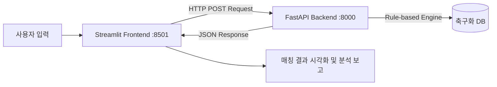

# 축구화 추천 프로그램 

본 프로젝트는 사용자의 플레이 스타일, 발볼 너비, 선호 무게감, 구장 환경, 예산 범위 등 5가지 핵심 요소를 종합 분석하여 가장 적합한 축구화 모델을 브랜드별로 추천하는 시스템입니다. 
**Streamlit(프론트엔드)**과 **FastAPI(백엔드)**가 REST API로 통신하며, **Docker Compose**를 통해 각 서비스가 독립된 컨테이너 환경에서 유기적으로 실행됩니다.

- **Front-end**: Streamlit ([front/app.py](front/app.py))
  - **접속 주소**: `http://<EC2의 퍼블릭 IP>:8501`
- **Back-end**: FastAPI ([back/main.py](back/main.py), [back/recommendation.py](back/recommendation.py))
  - **API 접속**: `http://<EC2의 퍼블릭 IP>:8000/`
- **Deployment**: Docker Compose ([docker-compose.yml](docker-compose.yml))

---
## 아키텍처 및 시스템 흐름

---
## 추천 데이터베이스 수록 제품군

본 프로젝트의 축구화 데이터는 각 브랜드 공식 홈페이지, KREAM, Crazy 11 등의 사이트를 참고하여 구성하였으며, 가격 정보는 공식 사이트의 정가를 기준으로 작성되었습니다.

| 브랜드 | 스피드 특화 | 컨트롤 특화 | 착화감 특화 |
| :--- | :--- | :--- | :--- |
| **Nike** | 줌 머큐리얼 베이퍼 17 | 팬텀 6 로우 | 티엠포 |
| **Adidas** | F50 | 프레데터 | 코파 퓨어 III·IV |
| **Puma** | 울트라 6 | 퓨처 9 | 킹 20 |

## 추천 엔진 채점 방식 (최대 100점)

사용자 입력과 각 축구화 속성을 3가지 축으로 비교하여 적합도를 산출합니다.

- **플레이스타일 매칭** (최대 40점): 유저 선호 스타일과 사일로 일치 여부
- **발볼 너비 매칭** (최대 40점): 유저 발볼과 축구화 핏 비교 (넓은 발볼 + 칼발 축구화 시 -30 페널티)
- **선호 무게감 매칭** (최대 20점): 유저 선호 무게와 축구화 무게 비교

각 브랜드별로 3개 사일로(speed, control, comfort)를 전부 채점하여 최고점 모델 1개를 선출하고, 구장별 아웃솔 매칭 및 예산 기반 등급 추천까지 수행합니다.
